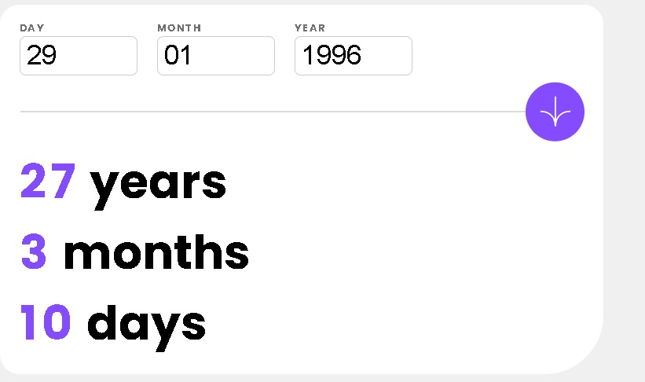
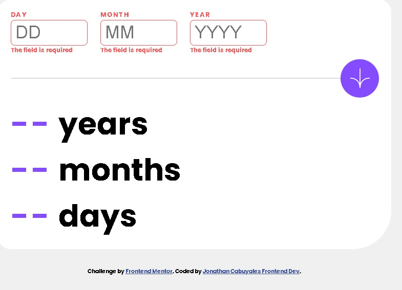
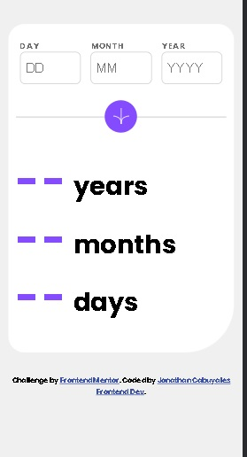

# Frontend Mentor - Age calculator app solution

This is a solution to the [Age calculator app challenge on Frontend Mentor](https://www.frontendmentor.io/challenges/age-calculator-app-dF9DFFpj-Q). Frontend Mentor challenges help you improve your coding skills by building realistic projects. 

## Table of contents

- [Overview](#overview)
  - [The challenge](#the-challenge)
  - [Screenshot](#screenshot)
  - [Links](#links)
- [My process](#my-process)
  - [Built with](#built-with)
  - [What I learned](#what-i-learned)
  - [Useful resources](#useful-resources)
- [Author](#author)
- [Acknowledgments](#acknowledgments)

**Note: Delete this note and update the table of contents based on what sections you keep.**

## Overview

### The challenge

Users should be able to:

- View an age in years, months, and days after submitting a valid date through the form
- Receive validation errors if:
  - Any field is empty when the form is submitted
  - The day number is not between 1-31
  - The month number is not between 1-12
  - The year is in the future
  - The date is invalid e.g. 31/04/1991 (there are 30 days in April)
- View the optimal layout for the interface depending on their device's screen size
- See hover and focus states for all interactive elements on the page
- **Bonus**: See the age numbers animate to their final number when the form is submitted

### Screenshot

- Age calculator completed 
- Empty inputs 
- mobile design 

### Links

- Solution URL: [Add solution URL here](https://your-solution-url.com)
- Live Site URL: [Add live site URL here](https://your-live-site-url.com)

## My process

### Built with

- Mobile-first workflow
- Semantic HTML5 markup
- CSS custom properties
- Flexbox

### What I learned

I learned that I need to keep practicing my js skills because I feel a little weak in some parts that are important and some of them we use every day. But, I felt comfortable to do it, so I can keep doing another challenge and never give up no matter how big or small is the problem we are developing. We can look for some inspiration from other people's solutions to help us solve the problem, but never copy it.

### Useful resources

- [Dev Docs API Documentation](https://devdocs.io/) - This helped me for knowing how to work with dates and Dom Manipulation.

## Author

- Website - [Jonathan Cabuyales](developing)
- Frontend Mentor - [@JonathanCabuyales](https://www.frontendmentor.io/profile/JonathanCabuyales)

## Acknowledgments

When I was developing this project there was a moment when I was blinded in my mind I felt frustrated and then I was looking for a solution that could help me with this problem and I found this website [Agustin Mulet](https://agustinmulet.dev/posts/calcular-edad-con-javascript/). I can give credit because I got some inspiration to solve the problem.

